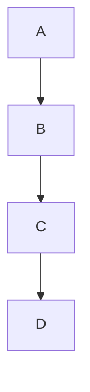

## Basic Syntax

### Headers
```markdown
# H1
## H2
### H3
#### H4
##### H5
###### H6
```

### Emphasis
```markdown
*italic* or _italic_
**bold** or __bold__
**_bold and italic_**
~~strikethrough~~
```

### Lists
```markdown
# Unordered
- Item 1
  - Sub-item 1
  - Sub-item 2
* Item 2
+ Item 3

# Ordered
1. First item
2. Second item
   1. Sub-item
   2. Sub-item
```

### Links
```markdown
[Link text](URL)
[Link with title](URL "title")
<URL>  # Auto-linked
```

### Images
```markdown


```

## Advanced Features

### Code Blocks
````markdown
```language
code goes here
```

```python
def hello_world():
    print("Hello, World!")
```
````

### Tables
```markdown
| Header 1 | Header 2 |
|----------|----------|
| Cell 1   | Cell 2   |
| Cell 3   | Cell 4   |

# Alignment
| Left | Center | Right |
|:-----|:------:|------:|
|Left  |Center  |Right  |
```

### Task Lists
```markdown
- [x] Completed task
- [ ] Incomplete task
- [ ] Another task
```

### Footnotes
```markdown
Here's a sentence with a footnote[^1].

[^1]: This is the footnote.
```

## GitHub-Specific Features

### Username @mentions
```markdown
@username
```

### Issue/PR References
```markdown
#123
username/repository#123
```

### Emoji
```markdown
:emoji_name:
:smile: :heart: :+1:
```

### Collapsed Sections
```markdown
<details>
<summary>Click to expand</summary>

Content goes here...
</details>
```

## Extended Formatting

### Alerts
```markdown
> [!NOTE]
> Highlights information.

> [!WARNING]
> Critical content.

> [!TIP]
> Helpful advice.
```

### Diagrams
```markdown

```

### Mathematical Expressions
```markdown
$x = {-b \pm \sqrt{b^2-4ac} \over 2a}$
```

## Best Practices

1. Keep lines under 80 characters
2. Use reference links for repeated URLs
3. Use semantic line breaks
4. Include table of contents for long documents
5. Use consistent heading hierarchy
6. Add alt text to images
7. Use appropriate code fence language tags